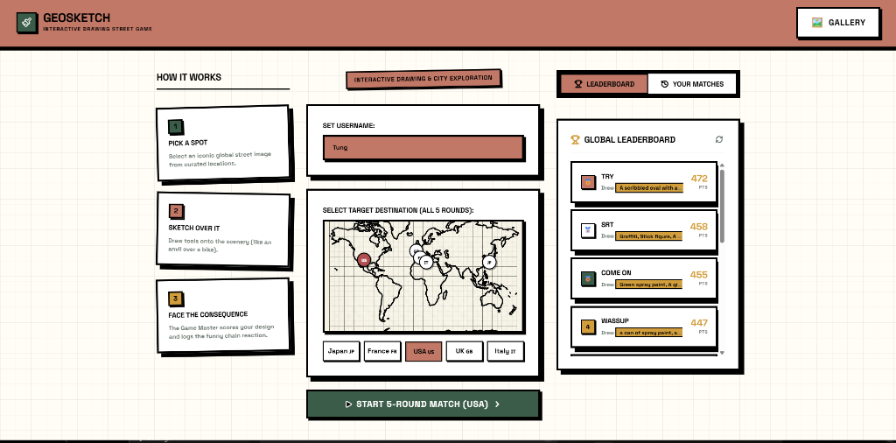

<div align="center">
  
  <h1>🌍 GeoSketch: AI-Powered Interactive Street Game</h1>
  <p>An interactive, full-stack web application where players fulfill chaotic commands by sketching directly onto real-world street views, evaluated in real-time by Multimodal AI.</p>
</div>

---

## 📖 Overview

**GeoSketch** is an advanced full-stack AI application designed as a next-generation interactive web game. Players are given an objective by an "Evil AI Game Master" (e.g., "Vandalize that wall", "Destroy that car") and must draw their solution onto a real-world street image using an HTML5 Canvas.

The drawing and the background are fused and evaluated by **Google Gemini Vision Models** to determine the drawn object, the target, and a chaotic, sarcastic twist consequence. 

## ✨ Key Features

- **🎨 Real-Time Interactive Canvas:** Custom HTML5 canvas engine allowing players to draw, erase, and adjust brush strokes on top of dynamic background images.
- **🤖 Multimodal AI Evaluation:** Integrates Google Gemini's vision capabilities to visually understand what the user drew and how it interacts with the background scene.
- **🧠 Local Machine Learning (ONNX):** Runs localized ML models for *Churn Prediction*, *Score Regression*, and *Effort Scoring* natively on the backend.
- **🔒 Stateless & Secure:** Uses short-lived JSON Web Tokens (JWT) for secure session management.
- **🛡️ Rate-Limited API:** Endpoints are protected by in-memory rate limiting (`slowapi`) to prevent API abuse and control costs.
- **☁️ Cloud Storage & Database:** Fully integrated with Supabase PostgreSQL for global leaderboards and Supabase Storage for archiving player sketches.

## 🏗️ System Architecture

* **Frontend:** React + Vite (Custom Neo-Brutalism UI, Canvas API)
* **Backend:** FastAPI (Python, Async I/O, Uvicorn)
* **Database:** Supabase PostgreSQL
* **Storage:** Supabase Object Storage (S3-compatible)
* **AI Providers:** Google Generative AI (Gemini Flash), Scikit-Learn (ONNX format)

---

## 🚀 Local Setup & Installation

### Prerequisites
- Node.js (v18+)
- Python (v3.10+)
- Supabase Project (Database & Storage bucket setup)

### 1. Clone & Install Dependencies

**Backend Setup:**
```bash
cd backend
python -m venv venv
# Windows: venv\Scripts\activate | Mac/Linux: source venv/bin/activate
pip install -r requirements.txt
```

**Frontend Setup:**
```bash
cd frontend
npm install
```

### 2. Environment Variables

Create a `.env` file in the **`backend/`** directory:
```env
# AI Models
GEMINI_API_KEY=your_gemini_key

# Supabase Configurations
SUPABASE_URL=your_supabase_url
SUPABASE_KEY=your_supabase_anon_key

# Security
JWT_SECRET_KEY=your_secure_random_string
```

### 3. Run the Servers

Start the **FastAPI Backend**:
```bash
cd backend
uvicorn main:app --reload --port 8000
```

Start the **React Frontend**:
```bash
cd frontend
npm run dev
```

Visit `http://localhost:5173` to play!

---

## 📊 Evaluation & Machine Learning Pipeline
GeoSketch doesn't just rely on a single API call; it uses a multi-layered evaluation pipeline:

1. **Computer Vision (Gemini 1.5 Flash):** 
   - Takes the Base64 encoded Canvas drawing superimposed over the background.
   - Evaluates *what* was drawn, *where* it was drawn (Target Object), and grades the **Semantic Score (0-100)** based on how well it matches the Evil AI's objective.
   - Generates a witty, chaotic consequence ("The Twist").

2. **Effort Scoring (Scikit-Learn / ONNX):** 
   - A local **Random Forest Model** analyzes the player's drawing metadata (stroke count, total path length, drawing time, bounding box area).
   - Punishes low-effort scribbles and rewards detailed sketches with an Effort Multiplier (0.5x to 1.5x).

3. **Score Normalization (ONNX Regressor):** 
   - A locally hosted regression model takes the semantic score and effort multiplier to calculate the final, normalized leaderboard score.

## 👨‍💻 Undergraduate Project Highlights
If evaluating this project for an academic submission, please note the following engineering achievements:
- **Stateless Architecture:** No heavy session state in the database. JWTs are used for 6-hour temporary play sessions.
- **Asynchronous Processing:** Heavy tasks like uploading the final fused image to Supabase Storage are handled via FastAPI `BackgroundTasks`, ensuring lightning-fast HTTP responses.
- **DDoS/Spam Protection:** In-memory sliding-window rate limiting (`slowapi`) protects the Gemini API from being exhausted by malicious scripts.
- **Advanced State Management:** Complex React state handling for drawing strokes, undo functionality, and game phase transitions.
